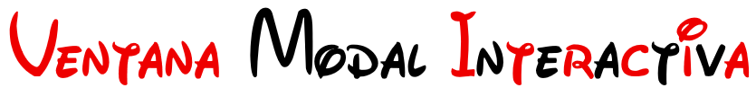
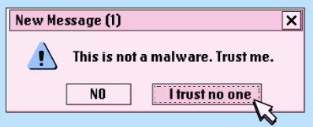
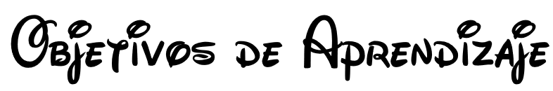
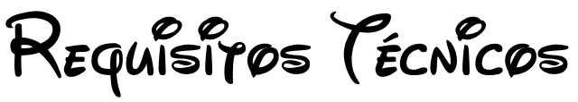
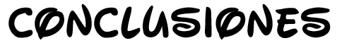
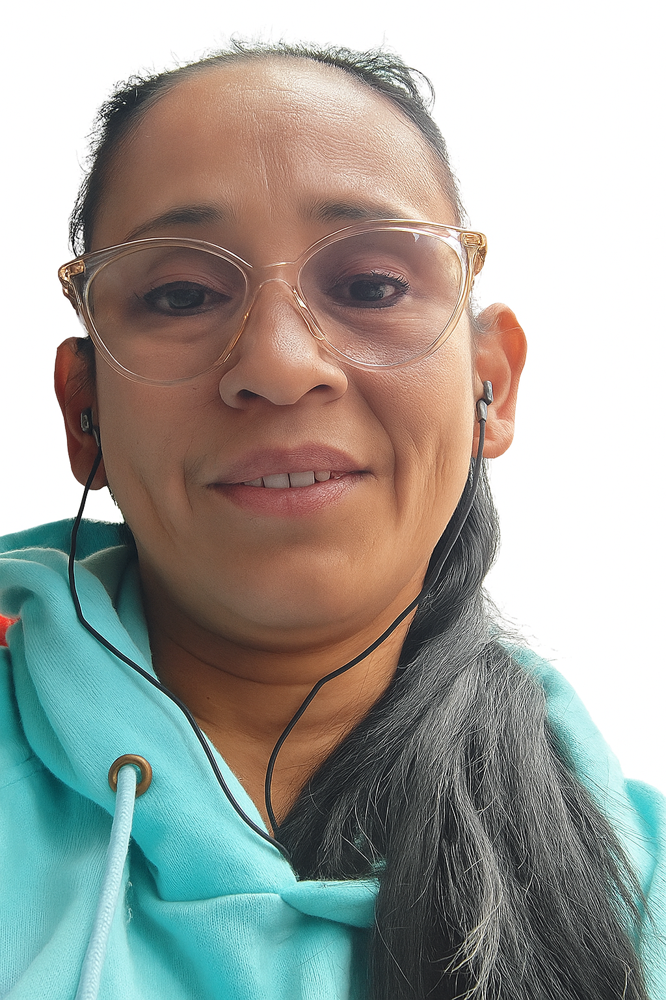

# 💖

 

Este proyecto corresponde al taller de **Introducción a los Lenguajes de Internet**, donde se desarrolla una ventana modal desde cero, utilizando **HTML, CSS y JavaScript**, combinando estas tres tecnologías para crear una interfaz interactiva, estética y funcional, aplicando conceptos de estructura, estilos y programación básica.

---

## 

1. [Descripción del trabajo](#descripción-del-trabajo)
2. [Objetivos de Aprendizaje](#objetivos-de-aprendizaje)
3. [Tecnologías usadas](#tecnologías-usadas)
4. [Requisitos Técnicos](#requisitos-técnicos)
5. [Resultado Final](#resultado-final)
6. [Recomendaciones](#recomendaciones)
7. [Conclusiones](#conclusiones)
8. [Desarrolladora](#desarrolladora)

---

## 

El proyecto consiste en la **creación de una ventana modal interactiva** que se activa mediante un botón. El modal incluye un título, un mensaje y un botón para cerrarlo. Además, se implementaron mejoras estéticas y temáticas relacionadas con el mes del **Amor y la Amistad**, agregando animaciones y elementos decorativos.
[⬆️ Volver al índice](#índice

---

## 

* Aplicar la **estructura de HTML** para organizar el contenido de la página.
* Implementar **CSS** para los estilos, colores, fondos y animaciones.
* Usar **JavaScript** para manejar la interacción de abrir y cerrar la ventana modal.
* Comprender cómo se integran estas tecnologías para construir componentes web dinámicos.

[⬆️ Volver al índice](#índice)

---

## 

* **HTML5** → Estructura del contenido.
* **CSS3** → Estilos, animaciones y diseño visual.
* **JavaScript (ES6)** → Funcionalidad e interactividad.

[⬆️ Volver al índice](#índice)

---

## 

* Navegador actualizado (Chrome, Edge, Firefox).
* Editor de código (Visual Studio Code recomendado).
* Archivos del proyecto:
   * `index.html`
   * `style.css`
   * `script.js`
   * Carpeta `img` con los recursos gráficos.
 
[⬆️ Volver al índice](#índice)

---

## 

Al ejecutar el proyecto, se observa una página con un botón que al hacer clic abre una ventana modal con un mensaje especial. El modal puede cerrarse haciendo clic en el botón "Cerrar" o en el fondo semi-transparente.

Adicionalmente, se incorporaron **decoraciones visuales (corazones flotando)** y un estilo adaptado a la temática del taller.

[⬆️ Volver al índice](#índice)

---

## 

[⬆️ Volver al índice](#índice)

* Mantener la estructura de carpetas organizada.
* Probar en diferentes navegadores para validar compatibilidad.
* Seguir buenas prácticas de nombrado en clases y archivos.
* Usar commits claros al subir los cambios en GitHub.

---

## 

* La creación de una ventana modal permite comprender la integración de **HTML, CSS y JavaScript** en un solo componente práctico.
* Las animaciones y estilos visuales enriquecen la experiencia del usuario, haciendo la interfaz más atractiva.
* Este proyecto representa un ejemplo introductorio de cómo se desarrollan componentes reutilizables en aplicaciones web modernas.

[⬆️ Volver al índice](#índice)

---

## 

Este proyecto fue desarrollado por Johana Jazmín Saavedra, estudiante de cuarto semestre en Técnica profesional en programación de aplicaciones de software de la Fundación Universitaria Compensar. Con una participación activa en la creación y desarrollo del proyecto.

  
   
  <strong>Johana Jazmín Saavedra</strong>

[⬆️ Volver al índice](#índice)

---
